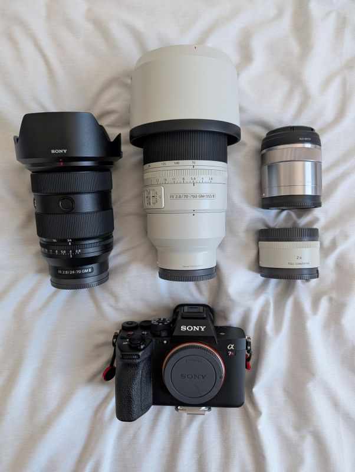
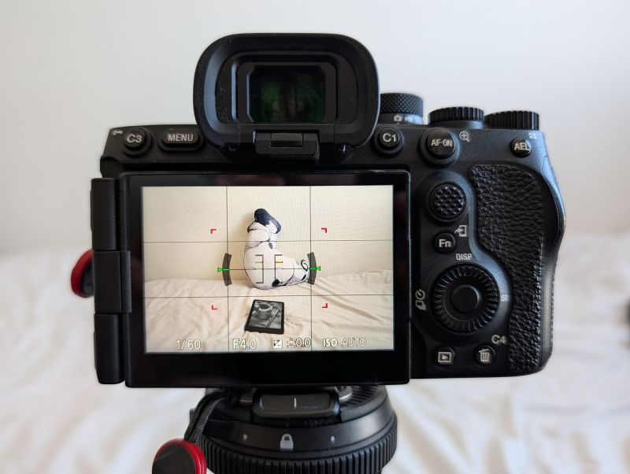
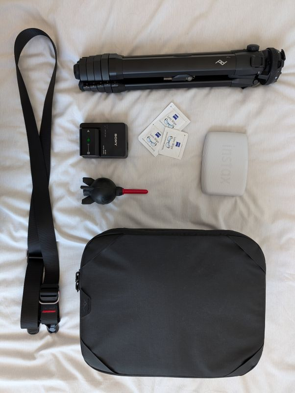

+++
title = "My photography setup"
date = 2026-02-15
description = "Cameras and gear"
[taxonomies]
types=["memory"]
+++

I've been a photography hobbyist since 2016, mostly specializing in urban photography and seeking the cinematic flair in everyday settings. You can find my pictures on [Instagram](https://www.instagram.com/erraineon/), [Twitter](https://x.com/errai/), and [BlueSky](https://bsky.app/profile/errai.bsky.social/).

I've used several mirrorless cameras and lenses over the course of my career. While the camera doesn't make the photographer, there's value in knowing your tools and how to use them.

Here is a list of cameras, lenses, and accessories I currently use, or have used in the past.

## My current setup

### Camera: Sony a7RV

I've been using it since 2023 and I love it.

#### What I like

{{figure(title="Sony a7RV", filename="body.jpg")}}

- Built like a tank and weather-sealed.
- A bright, multi-angle screen.
- Remote shutter/shooting capabilities.
- A fantastic high-resolution viewfinder.
- Tons of customizable controls with good ergonomics.
- Extremely fast startup time, even compared to the a7RIV.
- 8-stop in-body image stabilization lets me shoot handheld at 70mm, 1s. It's phenomenal.
- The eye-tracking is great. I don't really shoot portraits, but it's awesome for bird photography.
- It doesn't get in the way of my shooting. That's the most important aspect of any camera.

#### What I don't like

- Pricey and bulky.
- Even with the reinvented menus, they still feel dated. It's not an issue when you know them inside out, but it adds to the learning curve.
- Doesn't support [SFTP transfer](@/sony-lightroom-workflow.md).

#### Control mapping

{{figure(filename="bodyfocus.jpg", caption="Pressing C1 overrides the focus area with a small centered one.")}}

- **AF-ON**: focuses on the current area.
  - Decoupling focus from the shutter button lets you be more deliberate with the results, and prevents accidental last-moment focus hunting.
- **C1**: while held, focuses on a small area in the center.
  - Especially useful when the frame is busy or the subject is small, for instance a bird.
- **C2**: (on top of the camera) cycles through focus areas.
  - I rarely use it. the movable large area and the center focus triggered by C1 are usually sufficient.
- **C3**: opens the focus mode switcher. I mostly shoot in Continuous AF and Manual focus.
- **Joystick**: moves the current focus area.
- **Disp**: cycles between screen on and screen off. In conjunction with Auto Standby, it saves a ton of battery life.
- **Touch screen**: disabled, since sling-carrying the camera will register a lot of accidental inputs.
- The rest of the controls are bound to their default functions.

### Lenses

#### Sony FE 24-70mm F2.8 GM II

This stays onto my camera for most of the time and is my go-to choice for casual walks. It's clinical, lightweight (compared to similar options), and sharp at all ranges.

Some describe it as a boring lens since pictures taken with it are so flawless they lack personality. I post-process my photos, so I appreciate having a "clean slate" to work off.

#### Sony FE 70-200mm F2.8 GM OSS II

My telephoto of choice, and the sharpest lens I've ever owned.

When paired with a Sony FE 2.0x Teleconverter, it turns into a good F5.6 400mm, but I rarely need the extra reach because of how croppable photos taken with this lens are.

#### Sony E 30mm F3.5 Macro

An old and inexpensive macro lens I got in 2021. I use it rarely, but it's small and excels at what it does.
---

## Gear and accessories

- **Peak Design Travel Tripod**: I rarely use it, but it's small and portable for when I do need it.
- **Fujifilm Instax Mini Link 3**: I use it to gift photo prints on occasion, and for photo collages in my diary. I like its form factor.
- **Lens wipes**: I use them occasionally, but they're pretty good when the lens's outer element is really dirty.
  - Surprisingly awful on my reading glasses!
- **Sony charger and spare battery**: Small and gets the job done quickly. I usually need the second battery if I'm shooting all day.
- **Giottos Rocket Air Blaster**
- **Peak Design Camera Cube**: I use the Smedium size, fitting one lens and all my accessories.
- **Peak Design Slide Lite Camera Strap**

---

## Other cameras and lenses I owned

It took me several years to reach my current configuration. Most of the process wasn't about upgrades, as much as trying out many lenses to find what type of photography I wanted to focus on.

- **Sony Alpha 6300**: my first camera ever. I didn't know what cropped sensor was or what I wanted to shoot. I miss how portable it was sometimes.
- **Zeiss Touit 1.8/32**: my first lens ever. It was sharp, but not that great: the auto-focus was slow and noisy.
- **Sony E 10-18mm F4**: my first zoom lens. Except, it being 15mm-27mm, it was way too wide for my needs.
- **Sony APS-C E 18–135mm F3.5-5.6**: my favorite and last cropped sensor lens I owned. Great focal range, form factor and cost. It helped me realize I mostly shot at the extreme ends of the focal range.
- **Sony FE 70-200mm F4 G**: this was my gateway to upgrade from APS-C to full frame. It was a decent lens, but bulky and blurry around the corners.
  - I bought it used and it had dust in the lens element, causing spots to appear at f/9 or above. I ended up returning it.
- **Sony a7RIV**: my first full-frame camera. Compared to the a7RV, it had worse IBIS and eye-tracking, and much worse startup time.
- **Sony FE 200-600mm F5.6-6.3 G**: one of my favorite lenses, and for a while, the only one I used.
  - I was a much shyer photographer, preferring to keep my distance from the subject.
  - I absolutely loved the perspective compression of shooting at 600mm (or 1200mm, with a teleconverter).
  - It was an ideal lens for me, and helped me get into bird photography.
  - The main downside: it's heavy and bulky, and not the sharpest. But I still miss it sometimes.
- **Sony FE 12–24mm F4 G**: My first full-frame wide angle, while trying to get a lighter lens than the 200-600mm.
- **Sony FE 16-35mm F2.8 GM**: My first GM lens I rented for a while, which taught me that the price premium was not only about the extra light, but also image quality as a whole, and by a drastic amount.
  - This is also when I bought the Sony FE 70-200mm F2.8 GM II. I knew right away it was a keeper.
- **Sony FE 12-24mm F2.8 GM**: I got this used for a really good price, and used it for a few years.
  - While some 12mm shots turned out dramatic and gorgeous, it was really too wide for most occasions.
- **Sony FE 400-800mm F/6.3-8 G**: Huge, heavy, and really slow at 800mm, even in good light conditions. I would only recommend this for bird photographers with a healthy lower back.
- **Leica M10**: I wanted something lighter and more portable for daily use. I tried it out for one day with the 50mm Summicron.
  - While I enjoyed the clean interface, solid build, image quality (and blueish tint), and rangefinder experience, I couldn't justify its price.
- **Fujifilm X100VI**: My next iteration in the compact area.
  - I liked the form factor, but it wasn't quite as portable as I hoped for.
  - The fixed 35mm lens, while fast, felt limiting for my style.
  - Also, as a RAW shooter, the "recipes" aimed to replicate film look felt like a premium I wasn't using.
- **Sony RX100 VII**: My last small camera. I returned it since the viewfinder was defective, but it sported the features I wanted: actually pocketable and a 24-200mm effective focal range.
  - Pretty bad in low-light, even at ISO 3200. Noise removal helps, but still.
  - Not dust or weather proof. I would only use it as EDC.
  - I might buy another one at some point, but I'm hoping for a new version to come out.
