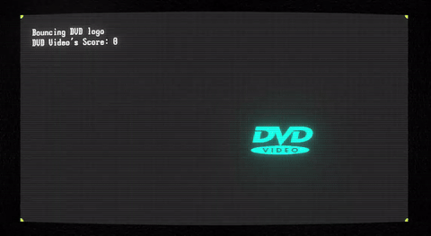
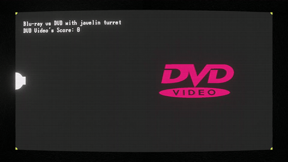

+++
title = "Screensaver logo simulator"
date = 2026-01-25
description = "Making things bounce"
[taxonomies]
types=["devlog"]
+++
While I was making dinner one day, I thought "I wonder if you can predict when the DVD logo hits the corner." Sure enough, it's a [pretty simple equation](https://youtu.be/saq3JGOsB3M?si=TRW_57mb-cLEFKqN). But what if the motion wasn't linear? What if the shape wasn't an axis-aligned bounding box? I decided to simulate that in Unity.

## The basics

My first goal was making a box bounce around, just like in the classic scenario. Rather than implementing the motion myself, I opted to choose Unity's 2D physics engine, as I already had ideas for scenarios which would be nightmarish to code from scratch. A simple rigidbody with a box collider and a material with no friction and max bounciness were enough to accomplish the first simulation.

For the visuals, I wanted to try out [Unity's Vector Graphics](https://docs.unity3d.com/Packages/com.unity.vectorgraphics@2.0/manual/index.html) library which, at the time of writing, is still in preview. The library allows working with SVG files, which implies:

{{figure(title="Rendered SVG example", filename="logo-collider.png")}}

- **Unlimited logo resolution**: nice to have instead of hunting for high-resolution PNGs.
- **Arbitrarily high collider definition**: since SVGs get tessellated and mapped to vertices, creating a perfect polygon collider is effortless.
- **Vertex colors**: this isn't explicitly stated in the documentation, but textureless SVGs leverage vertex colors, which certain shaders use instead of (or alongside) textures to render triangles.
- **Mesh mapping**: as I'm about to discuss, the Vector Graphics API was useful to build meshes at runtime more so than sprites.

To top it off, I downloaded a [CRT shader](https://github.com/Cyanilux/URP_RetroCRTShader) and implemented it as a full screen renderer feature, alongside a global volume to apply effects like bloom and panini distortion. The result:



## Going 3D

I wanted to make logos shatter on impact. There were a few libraries to accomplish that for sprites, but they were either paid assets or lacked features. I opted for [unity-fracture](https://github.com/ElasticSea/unity-fracture/tree/master), which internally leverages an old version of [NVidia Blast](https://github.com/NVIDIAGameWorks/Blast). This introduced several requirements.

### Converting sprites into meshes with depth

Mapping to meshes was already supported by the Vector Graphics API, so all I had to do was extrude it on the Z axis, which was [straightforward](https://github.com/erraineon/ScreenSaverTests/blob/5b8a373367588608042df509d55953f6e5e946fc/Assets/Scripts/CreateMeshFromSvg.cs#L89).

### Switching from vertex colors to textures

{{figure(caption="Z-fighting around the eyes.", filename="bob.gif")}}

The fracture library doesn't set vertex colors on chunks, so it was simpler to sample each vertex and add its color to a texture map to [generate a texture at runtime](https://github.com/erraineon/ScreenSaverTests/blob/5b8a373367588608042df509d55953f6e5e946fc/Assets/Scripts/VertexColorBaker.cs).

It's worth noting that overlapping SVG paths would result in multiple vertex groups which would then start z-fighting when observed in 3D. Thankfully, this was not an issue since all the logos were solid colors.

### Switching from 2D to 3D physics

This is where I started wishing I had implemented my own sprite-based solution. Not only the third dimension was an overhead these simulations really didn't need, having 3D chunks bound together by FixedJoints and using rotation constraints so they'd only spin on their Z axis meant that in most cases the generated structure couldn't rotate until its joints were destroyed.

### Result

With some tweaks, the library works well. Here's an example of before and after fracturing a logo. The dark circles represent joints that keep the chunks together until enough kinetic stress is applied to the object.


## Cut, cut

Next, my goal was to implement a turret that shot blades at logos, cutting them instead of shattering them. NVBlast [supports](https://nvidia-omniverse.github.io/PhysX/blast/docs/api/extensions/ext_authoring.html#fracturetool) said function:

```c++
virtual int32_t cut(
    uint32_t chunkId, 
    const NvcVec3& normal, 
    const NvcVec3& position,
    const NoiseConfiguration& noise,
    bool replaceChunk,
    RandomGeneratorBase* rnd
) = 0;
```

Easy, right? Nope.

{{figure(caption="NvBlastExtUnity_x64 exports", filename="dllviewer.png")}}

The unity-fracture library relies on a wrapper named `NvBlastExtUnity_x64.dll`. This file is old and doesn't expose a function that wraps around NVBlast's `cut` (not to be confused with slicing, which is fracturing alongside a grid rather than a voronoi diagram), which I verified by looking at the exports with DLL Export Viewer.

Furthermore, while the source code for this wrapper can still be found from [this post](https://discussions.unity.com/t/nvidia-blast/665733/72), it requires a non-trivial amount of setup to compile.

I figured the effort wasn't worth it, although someone else in the future may read this and wish I did that for the rest of the community. Once again, I wished I had stuck with 2D, as slicing a sprite is quite a bit simpler to write from scratch.

Thankfully, there are a few open source mesh slicing examples. I ended up using a modified version of [Mesh Cutter](https://github.com/hugoscurti/mesh-cutter/tree/master). The result:



## Conclusion

Coming up with new mechanics and making these logos fight is fun. I considered making it into a playable game, but I feel that interacting with the engine is not as interesting as watching the simulations unfold. So, I figured to publish the [source code](https://github.com/erraineon/ScreenSaverTests/tree/master) for this project if you're interested in running it yourself.

I'm also uploading each simulation on my [YouTube channel](https://www.youtube.com/@erraineon). You can find a playlist below.

{{ youtube(id="videoseries?si=R6JNSLaRNwOaFWJC&amp;list=PL6hGkuc1GXT_PmevncCPX8sQ6Gwd8Rz94")}}
